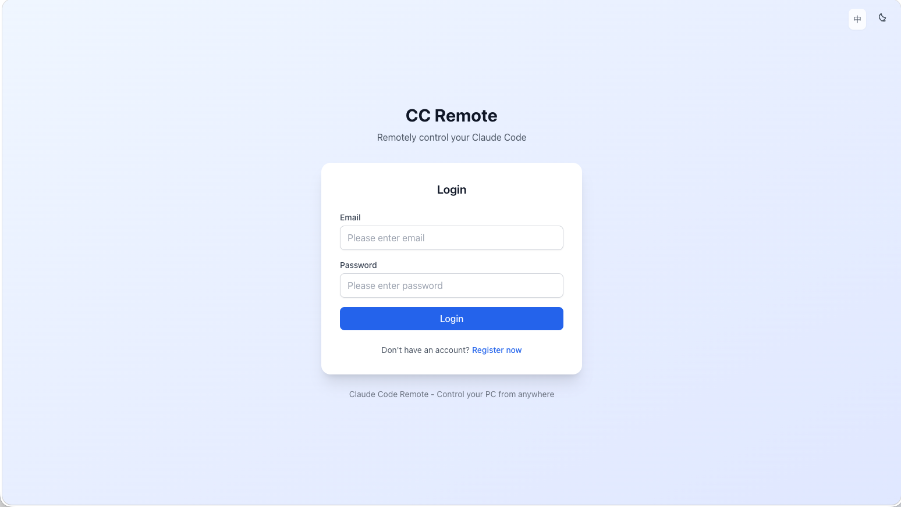
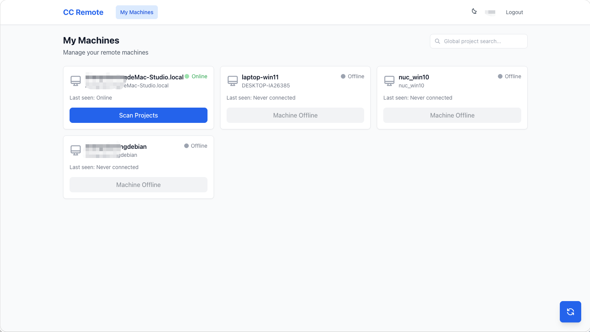
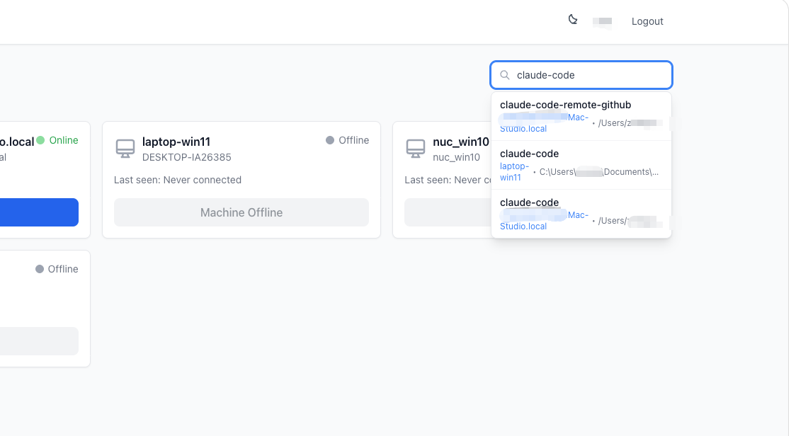
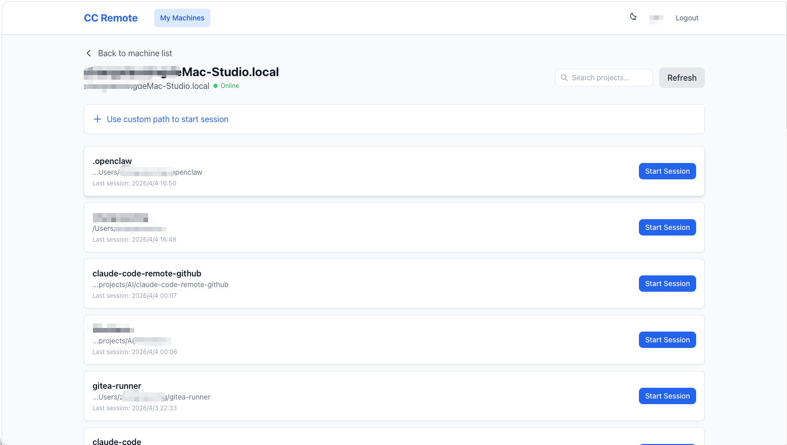
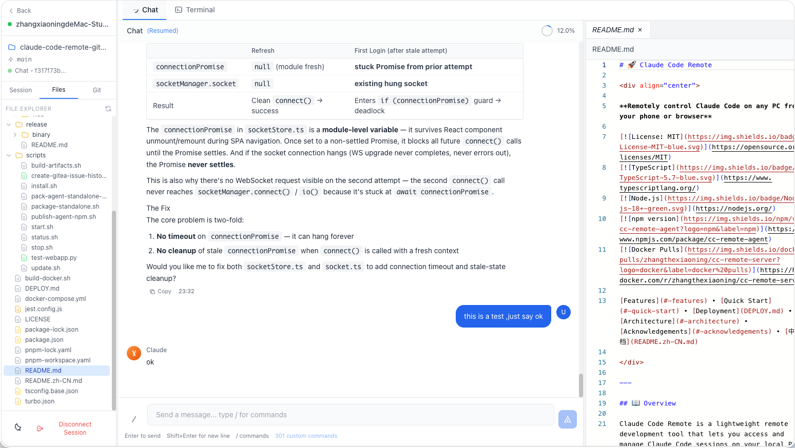
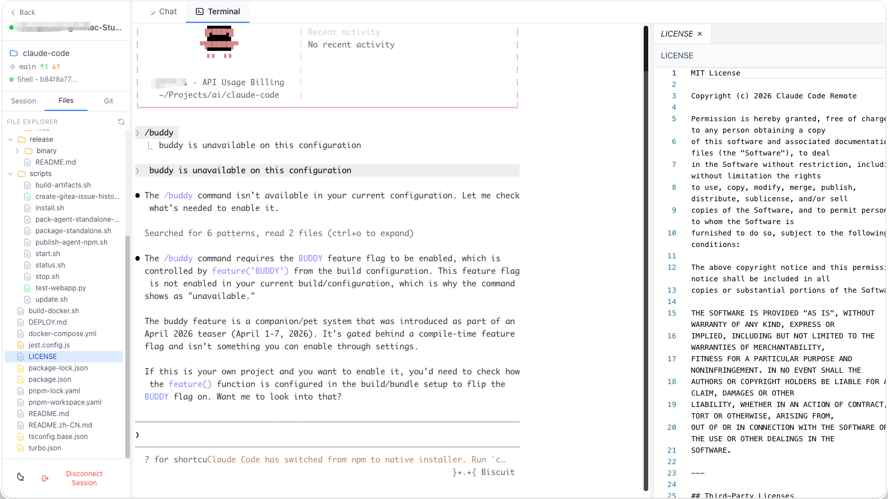
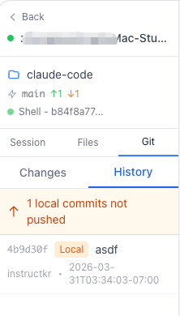

# 🚀 Claude Code Remote

<div align="center">

**从手机/浏览器远程控制任意 PC 上的 Claude Code**

[](https://opensource.org/licenses/MIT)
[](https://www.typescriptlang.org/)
[](https://nodejs.org/)
[](https://www.npmjs.com/package/cc-remote-agent)
[](https://hub.docker.com/r/zhangthexiaoning/cc-remote-server)

[功能特性](#-功能特性) • [快速开始](#-快速开始) • [部署与使用](DEPLOY.md) • [架构设计](#-架构设计) • [致谢](#-致谢)

</div>

---

## 📖 项目简介

Claude Code Remote 是一个轻量级的远程开发工具，让你能够从手机、平板或任意电脑访问和管理本地 PC 上的 Claude Code 会话。专为没有官方订阅的小团队设计，使用自己的算力和 API 实现远程 vibe coding。

## 📸 截图预览

<table>
  <tr>
    <td align="center"><b>登录页面</b></td>
    <td align="center"><b>机器列表</b></td>
    <td align="center"><b>机器搜索</b></td>
  </tr>
  <tr>
    <td></td>
    <td></td>
    <td></td>
  </tr>
  <tr>
    <td align="center"><b>项目列表</b></td>
    <td align="center"><b>对话模式</b></td>
    <td align="center"><b>终端模式</b></td>
  </tr>
  <tr>
    <td></td>
    <td></td>
    <td></td>
  </tr>
  <tr>
    <td align="center"><b>Git 历史</b></td>
    <td></td>
    <td></td>
  </tr>
  <tr>
    <td></td>
    <td></td>
    <td></td>
  </tr>
</table>

---

## 🆕 v1.2.0 Release Notes

feature:
1. Telegram Bot 集成 — InlineKeyboard 按钮、流式输出、会话管理、文件/图片上传、权限审批
2. 飞书 Bot 集成 — WebSocket 长连接（无需公网地址）、互动卡片按钮、流式文本编辑、文件/图片上传
3. 多平台 Bridge — Telegram 和飞书 Bot 可在同一进程中同时运行
4. Bot 账号绑定 — Telegram 深度链接 / 飞书绑定 URL → 网页登录 → JWT 重连
5. 聊天模式文件附件功能 — 支持通过按钮或拖拽上传图片和文本文件
6. 会话中断功能 — 使用 SDK `interrupt()` 方法
7. 文件树懒加载 — 展开目录时才加载子内容

bugfix:
1. 修复权限审批 ZodError（缺少 `updatedInput` 字段）
2. 修复 iOS 聊天输入框聚焦自动缩放
3. 修复 SDK 未发送 result 消息时 Web UI 卡在"生成中"
4. 修复工具执行后内容丢失
5. 修复会话恢复时历史消息不完整导致 Agent 崩溃

---

## v1.1.2 Release Notes

bugfix:
1. 修复 CI 工作流中已废弃的 `actions/upload-artifact@v3` 和 `actions/download-artifact@v3`（更新至 v4）
2. 修复 GitHub Release 创建失败 — 添加 `contents: write` 权限
3. 清理 publish-npm 任务 — 移除调试步骤和版本覆盖 hack

---

## v1.1.1 Release Notes

bugfix:
1. 修复大仓库 git status 响应过大导致 socket 断连
2. `cc-agent --version` 从 package.json 动态读取版本号

---

## v1.1.0 Release Notes

feature:
1. 国际化 (i18n) 支持 - 中英文双语切换
2. 简化 Agent 使用文档，首推交互式一键启动
3. Agent 支持 `--config-dir` 参数，可同时运行多个 Agent 实例

bugfix:
1. 移除 ChatStore 中所有调试日志，避免控制台污染
2. 修复 Tablet 区间布局死区，底部导航栏不可见导致无法操作
3. 修复 iOS Safari 输入框聚焦时页面自动缩放的问题

---

## v1.0.14 Release Notes

feature:
1. 多标签页编辑器：支持同时打开多个文件，标签页可滚动、可关闭全部
2. PC 模式下支持拖动调整侧边栏和编辑器面板宽度
3. 机器/工程列表页支持全局搜索，搜索结果可直接进入会话
4. 工程列表按最近会话时间排序
5. 窄屏模式下选择项目后提供会话选择列表
6. 支持用户输入自定义路径开启新会话
7. 工作区返回按钮改为返回工程列表（而非机器列表）
8. Git 历史区分已推送/未推送 commit（不同颜色显示）
9. 上下文 token/消息数实时显示
10. 自定义斜杠命令选择后带入输入框，而非直接发送

bugfix:
1. 切换会话时正确清理文件编辑器状态
2. 修复上下文显示一直为 0 的问题
3. 修复 leaveSession 使用旧编辑器属性导致的编译错误

---

## v1.0.13 Release Notes (2025-03)

feature:
1. 在工作空间侧边栏显示当前 Git 分支信息
2. 新增历史消息顺序修复相关的工单留档与脚本

bugfix:
1. 修复 `/` 斜杠命令在部分场景下无法识别的问题
2. 修复窄屏模式下页面出现横向滚动条的问题
3. 修复历史消息加载时，工具调用与文本消息顺序错乱的问题

### 🎯 适用场景

- ✅ 团队成员没有 Claude 订阅，无法使用官方 remote 功能
- ✅ 需要在任意场地开展 Claude vibe coding
- ✅ 管理多台 PC 上的多个工程
- ✅ 支持移动端（PWA）访问

---

## 📦 包管理器支持

本项目同时支持 **npm** 和 **pnpm** 两种包管理器：

| 操作 | npm | pnpm |
|------|-----|------|
| 安装依赖 | `npm install` | `pnpm install` |
| 启动 Server | `npm run dev:server` | `pnpm --filter @cc-remote/server dev` |
| 启动 Web | `npm run dev:web` | `pnpm --filter @cc-remote/web dev` |
| 启动 Agent (dev) | `npm run dev:agent` | `pnpm --filter @cc-remote/agent dev` |
| 启动 Telegram bot (dev) | — | `pnpm --filter cc-remote-bot dev`（需设置 `TELEGRAM_BOT_TOKEN`） |
| 构建 shared | `npm run build:shared` | `pnpm --filter @cc-remote/shared build` |
| 构建 server | `npm run build:server` | `pnpm --filter @cc-remote/server build` |
| 构建 agent | `npm run build:agent` | `pnpm --filter @cc-remote/agent build` |
| 数据库生成 | `npm run db:generate` | `pnpm --filter @cc-remote/server db:generate` |
| 数据库推送 | `npm run db:push` | `pnpm --filter @cc-remote/server db:push` |
| 运行测试 | `npm test` | `pnpm test` |

> 💡 **提示**: npm 版本需要 >= 9.0.0 以支持 workspaces

---

## ✨ 功能特性

### 双模式会话

- 🤖 **Chat 模式** - 通过 Claude Agent SDK 进行 AI 对话，支持工具调用、权限审批、流式输出
- 🖥️ **Shell 模式** - 基于 xterm.js 的远程终端，支持 PTY 交互和窗口尺寸自适应

### Chat 体验（对标 Claude Code UI）

- 💬 **富文本消息** - Markdown 渲染、代码高亮、复制按钮、表格样式
- 📂 **历史会话** - 浏览和恢复历史对话，完整加载历史消息内容
- ⚡ **斜杠命令** - 输入 `/` 唤出命令面板，支持内置命令、模型切换、Skills、Plugin 命令
- 🔧 **工具调用** - 可折叠展示工具名称、输入参数、执行结果，带状态指示
- 🛡️ **权限管理** - 工具执行前的权限审批 UI（允许/拒绝）

### 工作空间

- 🗂️ **文件浏览器** - 侧边栏显示项目文件树，支持折叠展开，按文件类型显示图标
- 📜 **会话列表** - 侧边栏查看历史会话，一键查看内容或恢复会话
- 🔀 **多标签页** - Shell 和 Chat 标签页并存，灵活切换

### 基础设施

- 🔐 **双重认证** - JWT + machine_token 安全机制
- 🖥️ **多 PC 管理** - 每个用户可管理多台 PC，实时在线状态
- 📱 **移动端支持** - 响应式设计，PWA 支持
- 🔄 **实时通信** - Socket.io 双向实时通信，Agent/Client 命名空间分离
- 🛡️ **安全防护** - 速率限制、密码哈希、输入验证

### 技术亮点

- **Monorepo 架构** - Turborepo + pnpm workspace，共享类型、独立构建
- **TypeScript 全栈** - 从 shared types 到前后端，端到端类型安全
- **Claude Agent SDK** - 集成 `@anthropic-ai/claude-agent-sdk`，支持 `query`、`listSessions`、`getSessionMessages`
- **Prisma ORM** - 类型安全的数据库操作
- **Zustand 状态管理** - 轻量级、无样板代码
- **优雅重启** - 开发模式下自动端口回收，避免 EADDRINUSE

---

## 🏗️ 架构设计

```
┌─────────────┐          ┌──────────────┐          ┌─────────────┐
│ 客户端      │◄────────►│   云服务器    │◄────────►│ PC守护进程  │
│ (Web/PWA)   │ Socket.io│ (Express)    │ Socket.io │ (Agent)     │
└─────────────┘   +JWT   └──────────────┘   +JWT   └─────────────┘
                               │                        │
                               ▼                        ▼
                        ┌──────────────┐         ┌─────────────┐
                        │   SQLite     │         │ Claude Code │
                        │ (Prisma ORM) │         │   进程      │
                        └──────────────┘         └─────────────┘
```

### 技术栈

| 组件 | 技术 |
|------|------|
| **Server** | Node.js + Express + Socket.io + Prisma + tsx watch |
| **Agent** | Node.js + Commander + Socket.io-client + Claude Agent SDK |
| **Web** | React + Vite + Tailwind + xterm.js + Zustand |
| **Database** | SQLite + Prisma ORM |
| **Auth** | JWT + bcrypt |
| **Chat 渲染** | react-markdown + remark-gfm + react-syntax-highlighter |

---

## 🚀 快速开始

### 前置要求

- Node.js >= 18.0.0
- npm >= 9.0.0 或 pnpm >= 9.0.0
- Claude Code CLI 已安装（Shell 模式）
- `ANTHROPIC_API_KEY` 环境变量已设置（Chat 模式，在 Agent 端机器上配置）

### 安装步骤

1. **克隆项目**
```bash
git clone https://github.com/your-username/cc-remote.git
cd cc-remote
```

2. **安装依赖**

```bash
# 使用 npm
npm install

# 或使用 pnpm
pnpm install
```

3. **初始化数据库**

```bash
# 使用 npm
npm run db:generate
npm run db:push

# 或使用 pnpm
pnpm --filter @cc-remote/server db:generate
pnpm --filter @cc-remote/server db:push
```

4. **配置环境变量**
```bash
cp packages/server/.env.example packages/server/.env
# 编辑 .env 文件，设置 JWT_SECRET 等配置
```

5. **启动服务**

使用 npm：
```bash
# 终端1: 启动服务器
npm run dev:server

# 终端2: 启动Web UI
npm run dev:web

# 终端3: 构建并启动Agent
npm run build:agent
cd packages/agent
node dist/index.js bind --token <your-jwt-token>
node dist/index.js start

# 终端4（可选）: Telegram Bot — 环境变量与绑定说明见下文「Telegram Bot（可选）」
cd packages/bot
npm run build
TELEGRAM_BOT_TOKEN=<你的_BotFather_令牌> node dist/index.js
```

使用 pnpm：
```bash
# 终端1: 启动服务器
pnpm --filter @cc-remote/server dev

# 终端2: 启动Web UI
pnpm --filter @cc-remote/web dev

# 终端3: 构建并启动Agent
pnpm --filter @cc-remote/agent build
cd packages/agent
node dist/index.js bind --token <your-jwt-token>
node dist/index.js start

# 终端4（可选）: Telegram Bot — 环境变量与绑定说明见下文「Telegram Bot（可选）」
pnpm --filter cc-remote-bot build
cd packages/bot
TELEGRAM_BOT_TOKEN=<你的_BotFather_令牌> node dist/index.js
```

#### Telegram Bot（可选）

1. 在 [@BotFather](https://t.me/BotFather) 创建机器人，复制 **HTTP API token**。
2. **环境变量**（部分可用命令行覆盖）：
   - `TELEGRAM_BOT_TOKEN` — 必填；也可在启动时传 `--bot-token <token>`
   - `BOT_SERVER_URL` — 本项目的 Server 地址（默认 `http://localhost:3000`）；可用 `--server <url>` 覆盖
   - `BOT_PORT` — Bot 本地 HTTP 服务端口，用于绑定校验与回调（默认 `3001`）；可用 `--port <port>` 覆盖
3. **URL 对齐**：Server 与 Web 必须能访问到 Bot 的 HTTP 服务。本机开发时默认：
   - `packages/server/.env` 中未设置时，`BOT_SERVICE_URL` 默认为 `http://localhost:3001`（需与 Bot 监听地址一致）
   - Web 绑定页开发时，`VITE_BOT_SERVICE_URL` 默认 `http://localhost:3001`（若 Bot 部署在其他地址，可在 `packages/web/.env` 中配置）
4. **启动 Bot**（需先启动 Server）：

```bash
pnpm --filter cc-remote-bot build
cd packages/bot
TELEGRAM_BOT_TOKEN=<token> node dist/index.js
# 或：node dist/index.js --bot-token <token> --server http://localhost:3000 --port 3001

# 开发（监听编译 + nodemon）
pnpm --filter cc-remote-bot dev
# 在 shell 或环境中设置 TELEGRAM_BOT_TOKEN
```

5. 在 Telegram 中对机器人发送 `/start`，在浏览器中打开绑定链接并登录完成账号绑定。

6. **访问应用**
- Web UI: http://localhost:5173
- Server API: http://localhost:3000
- 健康检查: http://localhost:3000/health

---

## 🧪 测试指南

### 快速测试（5分钟）

#### 1️⃣ 注册账户

浏览器访问 http://localhost:5173，点击"注册"，输入邮箱和密码即可。

#### 2️⃣ 启动 Agent

```bash
npm run build:agent
cd packages/agent
node dist/index.js
```

按提示输入服务器地址、邮箱密码和机器名称，自动完成绑定和连接。

#### 3️⃣ 测试会话
```
刷新网页 → 看到在线PC（绿色）
→ 点击"扫描工程"
→ 选择工程 → 进入工作空间
→ Chat 标签：与 Claude 对话，测试斜杠命令（输入 /）
→ Shell 标签：远程终端，输入命令测试
→ 侧边栏：切换"会话"和"文件"标签页
```

### 自动化测试

```bash
# 使用 npm
npm test
npm test -- --coverage
npm test tests/unit/auth.test.ts

# 使用 pnpm
pnpm test
pnpm test -- --coverage
pnpm test tests/unit/auth.test.ts
```

### 测试检查清单

- [ ] 服务器正常启动（http://localhost:3000/health）
- [ ] Web UI 可访问（http://localhost:5173）
- [ ] 用户注册/登录成功
- [ ] Agent 绑定成功并显示在线
- [ ] 工程扫描成功
- [ ] Chat 模式：发送消息、收到 AI 回复、工具调用展示
- [ ] Chat 模式：`/` 唤出命令面板，显示 Skills 列表
- [ ] Chat 模式：选择历史会话，加载历史消息
- [ ] Shell 模式：终端输入命令正常工作
- [ ] 侧边栏：文件浏览器正常展示项目文件树
- [ ] 多标签页同步正常

---

## 📦 项目结构

```
cc-remote/
├── packages/
│   ├── shared/              # 共享类型和常量
│   │   └── src/
│   │       ├── types.ts           # 全局类型（ChatMessage、FileTreeItem、SlashCommand 等）
│   │       └── constants.ts       # Socket 事件名、配置常量
│   │
│   ├── server/              # Express + Socket.io 中继服务器
│   │   └── src/
│   │       ├── index.ts           # 入口、优雅重启、端口回收
│   │       ├── auth.ts            # JWT 认证中间件
│   │       ├── routes/            # REST API（auth、machines、projects）
│   │       └── socket/            # Socket.io 命名空间
│   │           ├── agent.socket.ts    # Agent → Server → Client 转发
│   │           ├── client.socket.ts   # Client → Server → Agent 转发
│   │           └── store.ts           # 在线 Agent 状态管理
│   │
│   ├── agent/               # PC 守护进程 CLI
│   │   └── src/
│   │       ├── index.ts           # Commander CLI（bind/start/status）
│   │       ├── client.ts          # Socket 客户端 + 事件分发
│   │       ├── session.ts         # PTY Shell 会话管理
│   │       ├── sdk-session.ts     # Claude Agent SDK 会话管理（Chat 模式）
│   │       └── scanner.ts         # 工程目录扫描
│   │
│   └── web/                 # React Web UI
│       └── src/
│           ├── components/
│           │   ├── chat/              # Chat 模式组件
│           │   │   ├── ChatInterface.tsx   # 聊天主容器
│           │   │   ├── ChatMessagesPane.tsx# 消息列表
│           │   │   ├── MessageComponent.tsx# 单条消息渲染（User/AI/Tool/Error）
│           │   │   ├── ChatComposer.tsx   # 输入框 + 斜杠命令面板
│           │   │   └── PermissionBanner.tsx# 权限审批横幅
│           │   ├── shell/             # Shell 模式组件
│           │   │   └── Shell.tsx          # xterm.js 终端
│           │   └── workspace/         # 工作空间布局
│           │       ├── WorkspaceLayout.tsx # 主布局（侧边栏 + 内容区）
│           │       ├── Sidebar.tsx        # 侧边栏（会话列表 / 文件浏览器）
│           │       └── WorkspaceTabs.tsx  # Chat/Shell 标签切换
│           ├── pages/
│           │   ├── ProjectsPage.tsx   # 项目列表页
│           │   └── WorkspacePage.tsx   # 工作空间主页
│           ├── stores/
│           │   ├── sessionStore.ts    # 会话、文件树、命令状态
│           │   ├── chatStore.ts       # Chat 消息、历史、生成状态
│           │   └── socketStore.ts     # Socket 连接状态
│           └── lib/
│               └── socket.ts          # Socket.io 客户端封装
│
├── docs/                    # 文档
├── turbo.json               # Turborepo 配置
├── pnpm-workspace.yaml      # pnpm 工作区
└── package.json             # 根配置
```

---

## 🔧 配置说明

### Server 环境变量

```env
# 数据库
DATABASE_URL="file:./dev.db"

# 服务器
PORT=3000
NODE_ENV=development

# 安全（生产环境必须设置）
JWT_SECRET=your-super-secret-jwt-key-change-in-production
JWT_EXPIRES_IN=7d

# CORS
CORS_ORIGIN=http://localhost:5173
```

### Agent CLI 命令

```bash
# 交互式启动（推荐，首次运行自动引导绑定）
cc-agent

# 查看状态
cc-agent --status

# 重新绑定
cc-agent --rebind

# 解除绑定
cc-agent --unbind

# 指定配置目录（多实例运行）
cc-agent --config-dir ~/.cc-agent-2
```

---

## 🧪 测试

```bash
# 使用 npm
npm test                    # 运行所有测试
npm test -w @cc-remote/server  # 运行特定包的测试
npm test -- --coverage      # 生成测试覆盖率报告

# 使用 pnpm
pnpm test                   # 运行所有测试
pnpm --filter @cc-remote/server test  # 运行特定包的测试
pnpm test -- --coverage     # 生成测试覆盖率报告
```

---

## 📊 开发进度

### 已完成

- [x] Monorepo 项目结构搭建（Turborepo + pnpm workspace）
- [x] Prisma Schema 设计 + SQLite
- [x] Server 核心功能（认证 + Socket 命名空间转发）
- [x] Agent CLI 核心功能（bind / start / status / scan）
- [x] Web UI 基础功能（登录、注册、项目列表）
- [x] **Phase 1** — Agent SDK 集成（Chat 模式后端）
- [x] **Phase 2** — Web 工作空间布局（Sidebar + Tabs）
- [x] **Phase 3** — Chat UI（消息渲染、流式输出、工具调用、权限审批）
- [x] **Phase 4** — Shell 终端增强 + 连接状态
- [x] **会话恢复** — 历史会话浏览 + resume（对接 SDK listSessions / getSessionMessages）
- [x] **斜杠命令** — `/` 唤出命令面板，内置命令 + 模型切换 + Skills + Plugin 命令
- [x] **文件浏览器** — 侧边栏文件树，递归展示项目目录结构
- [x] **开发体验** — tsx watch 热重载、端口自动回收、优雅重启

### 计划中

- [ ] 完整的单元测试覆盖（目标 70%+）
- [ ] API 文档（Swagger / OpenAPI）
- [x] **Docker 部署** — Server+Web 单镜像、docker-compose、Agent CLI 打包与安装（见 [DEPLOY.md](DEPLOY.md)）
- [ ] 移动端 App（React Native / PWA 增强）
- [ ] 多用户协作（共享会话）
- [ ] 会话搜索与标签管理

---

## 🤝 贡献指南

欢迎贡献！请查看 [CONTRIBUTING.md](CONTRIBUTING.md) 了解详情。

### 开发流程

1. Fork 本仓库
2. 创建特性分支 (`git checkout -b feature/AmazingFeature`)
3. 提交更改 (`git commit -m 'Add some AmazingFeature'`)
4. 推送到分支 (`git push origin feature/AmazingFeature`)
5. 创建 Pull Request

---

## 📝 License

本项目采用 MIT License 开源协议 - 查看 [LICENSE](LICENSE) 文件了解详情。

---

## 🙏 致谢

本项目在设计和实现过程中参考了以下优秀的开源项目：

### 核心参考项目

1. **[Happy Coder](https://github.com/slopus/happy)** by slopus
   - 架构设计参考：Socket.io 双向通信、双重认证机制
   - CLI设计参考：Commander框架使用、系统服务安装
   - License: MIT

2. **[Claude Code WebUI](https://github.com/sugyan/claude-code-webui)** by sugyan
   - Web UI设计参考：xterm.js终端集成、会话管理
   - 前端架构参考：React + Vite技术栈
   - License: MIT

3. **[CloudCLI/Claude Code UI](https://github.com/siteboon/claudecodeui)** by siteboon
   - 功能设计参考：多会话管理、工程扫描
   - UI设计参考：响应式布局、状态管理
   - License: GPL-3.0

4. **[Claude Code](https://github.com/anthropics/claude-code)** by Anthropic
   - Chat UI 交互参考：消息渲染、斜杠命令、会话恢复
   - Agent SDK 集成参考：`query`、`listSessions`、`getSessionMessages` API
   - Skills/Commands 发现机制参考
   - License: Apache-2.0

### 技术栈致谢

- **[Express](https://expressjs.com/)** - Web框架
- **[Socket.io](https://socket.io/)** - 实时通信
- **[Prisma](https://www.prisma.io/)** - 数据库ORM
- **[React](https://reactjs.org/)** - 前端框架
- **[Vite](https://vitejs.dev/)** - 构建工具
- **[xterm.js](https://xtermjs.org/)** - 终端模拟器
- **[Zustand](https://github.com/pmndrs/zustand)** - 状态管理
- **[@anthropic-ai/claude-agent-sdk](https://www.npmjs.com/package/@anthropic-ai/claude-agent-sdk)** - Claude Agent SDK
- **[react-markdown](https://github.com/remarkjs/react-markdown)** - Markdown 渲染
- **[react-syntax-highlighter](https://github.com/react-syntax-highlighter/react-syntax-highlighter)** - 代码高亮

---

## 📞 联系方式

- **问题反馈**: [GitHub Issues](https://github.com/your-username/cc-remote/issues)
- **功能建议**: [GitHub Discussions](https://github.com/your-username/cc-remote/discussions)

---

<div align="center">

**如果这个项目对你有帮助，请给一个 ⭐️ Star！**

Made with ❤️

有任何问题可邮件反馈：markbruce@163.com

</div>
